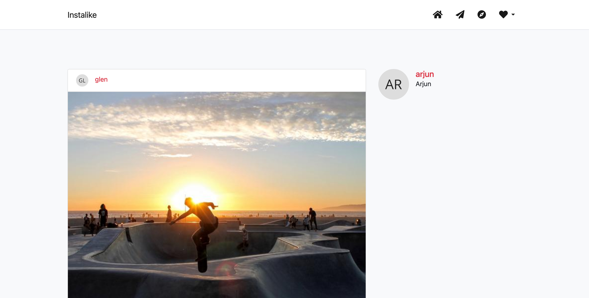
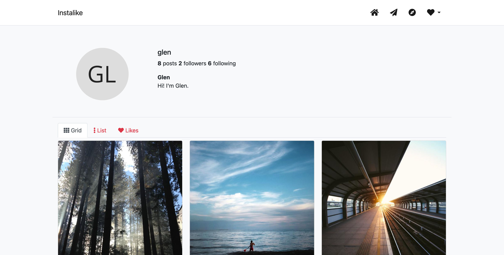

# Instalike

Instalike is a clone of the Instagram desktop application, written in Python
with Flask. It's still a work in progress.

## Screenshots

### Home page



### User profile



## Installation

There is a [Makefile](./Makefile) to help you
getting started, running the following commands
should work:

```bash
# create a virtual env and install libraries
make venv/bin/activate

# initialize the sqlite database
make init

# run the flask application in debug mode
make start
```

## Data model

We use a single relational database (namely sqlite)
with SQL Alchemy ORM to handle the data. The tables are defined in the [src.application.model](./src/application/model.py) module.

Here are some code snippets to show you how we populate
the database.

```python
# create a user
user = User(username="username",
            email="username@example.com",
            fullname="User Name",
            bio="Hi! I'm User",
            avatar="image_url")

# create a post for this user
post = Post(user_id=user.id,
            content="Here's my post!",
            picture="image_url")

# make the user like the post
user.likes.append(post)

# make the user comment the post
comment = Comments(user=user,
                   content="Love it!")
post.comments.append(comment)

# make the user follow another user
user.follows.append(another_user)

```
